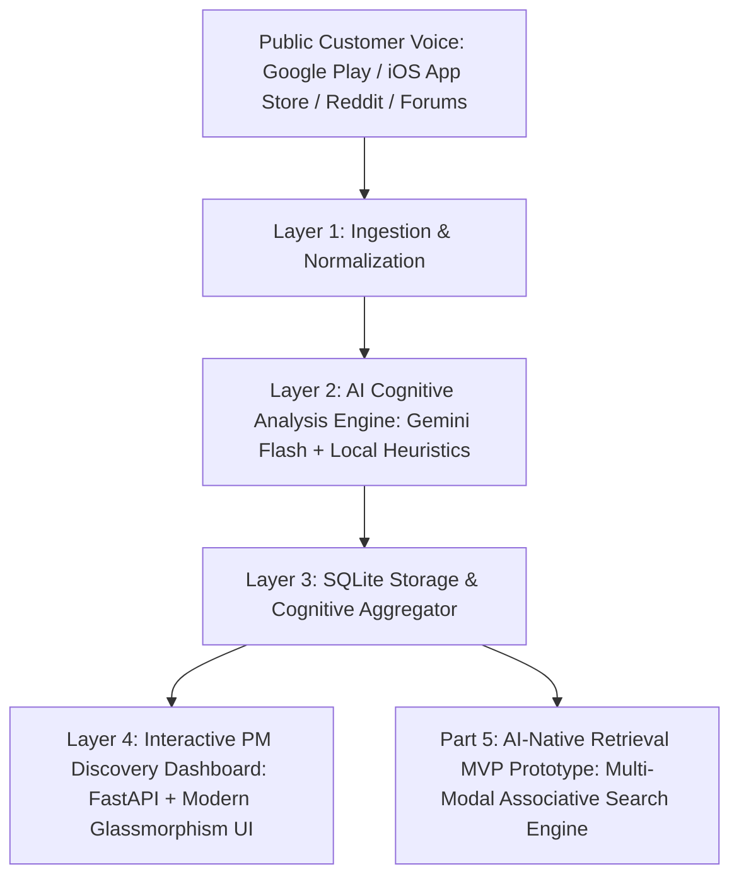

# 📸 Google Photos AI Discovery Engine & Retrieval MVP

> **NextLeap Product Management Fellowship Graduation Project (Core Experience Team — Google Photos)**
>
> An AI-powered discovery engine and interactive retrieval prototype uncovering why Google Photos users struggle to find vaguely remembered photos, transforming unstructured customer voice into actionable PM insights and demonstrating an AI-native associative memory search engine — with strictly **₹0 infrastructure cost**.

---

## 🎯 The Core Problem: The Cognitive Retrieval Gap

Google Photos users store thousands of photos and videos. When attempting to retrieve a specific past memory, users experience severe friction:

- **Episodic Human Memory vs. Algorithmic Rigidity:** Humans remember photos through sensory, situational, and emotional associations:
  > *"that rainy afternoon cafe in Goa where we had breakfast with Rohan and sat on blue chairs"*
- **Current Retrieval Bottleneck:** Traditional search engines rely on strict keyword tags, optical character recognition (OCR), or exact timestamps. When queries miss exact metadata, users encounter:
  1. `zero_results` (false negatives despite the photo existing)
  2. `overwhelming_results` (thousands of unranked photos requiring endless scrolling)
  3. `semantic_misunderstanding` (literal interpretation of figurative or contextual words)
  4. `ocr_text_mismatch` (over-indexing on random background signs instead of subject)
  5. `temporal_disconnect` (user recalls season or event; system requires exact calendar date)
  6. `synonym_blindness` (failing to bridge "beach shack" with "seaside bistro")
  7. `scroll_fatigue_abandonment` (user drops off after scrolling through 50+ photos)

---

## 📊 Business Metric Decomposition

$$\text{Search Success Index} = Q_f \times S_m \times C_d \times R_e$$

| Component | Metric Definition | Target Impact |
|---|---|---|
| **$Q_f$ (Query Formulation Rate)** | % of active users attempting a natural memory search monthly | $+18\%$ via intuitive conversational prompting |
| **$S_m$ (Semantic Match Rate)** | % of queries returning candidate photos in top 5 results | $+34\%$ through multi-modal associative clue expansion |
| **$C_d$ (Cognitive Disconnect Rate)** | % of searches ending in zero results or immediate abandonment | $-45\%$ via fuzzy semantic tolerance & synonym graphs |
| **$R_e$ (Retrieval Efficiency / TTFR)** | Mean time-to-first-relevant-result & scroll depth before selection | Reduced from $42\text{s} \to 9\text{s}$ |

---

## 🏗️ 4-Layer Architecture + Part 5 Retrieval MVP (₹0 Stack)



| Layer | Component | Technology | Cost |
|---|---|---|---|
| **Layer 1: Ingestion** | Scrapers & Cleaners | `google-play-scraper` (`com.google.android.apps.photos`), App Store RSS (`962194608`), Reddit PRAW & Apify (`r/googlephotos`, `r/google`, `r/Android`, `r/techsupport`) | ₹0 |
| **Layer 2: AI Analysis** | Cognitive Extraction & Classifier | Gemini 2.5 Flash / Flash Lite + Offline NLP Fallback + Confidence Scorer | ₹0 |
| **Layer 3: Storage** | Database & Indexes | SQLite 3 (WAL Mode) with composite indexing on cognitive tags | ₹0 |
| **Layer 4: Dashboard** | PM Intelligence UI | FastAPI, Jinja2, Chart.js, Vanilla CSS Glassmorphism | ₹0 |
| **Part 5: Retrieval MVP** | Associative Memory Prototype | FastAPI `/api/retrieval-mvp/search`, Clue Extraction Engine, Interactive Sandbox | ₹0 |

---

## ⚡ Quick Start

### 1. Clone & Setup
```bash
git clone https://github.com/Shubham-vvn/google-photos-discovery-engine.git
cd google-photos-discovery-engine

# Create and activate virtual environment
python3 -m venv venv
source venv/bin/activate     # macOS / Linux
# venv\Scripts\activate      # Windows

pip install -r requirements.txt
```

### 2. Configure Environment
```bash
cp .env.example .env
```
Edit `.env` and add your **free** API keys:
- `GEMINI_API_KEY`: Free from [Google AI Studio](https://aistudio.google.com)
- `APIFY_API_TOKEN`: Optional (free tier)
- `REDDIT_CLIENT_ID` / `REDDIT_CLIENT_SECRET`: Optional (for Reddit PRAW scraper)

### 3. Seed Database & Run Analysis
The project comes pre-seeded with 300 realistic Google Photos customer voice records across Google Play, Apple App Store, and Reddit:
```bash
# Seed synthetic + real customer voice documents
python scripts/seed_db.py

# Run ingestion (live scrapers)
python scripts/run_ingestion.py --source google_play --limit 100

# Run cognitive extraction pipeline
python scripts/run_analysis.py
```

### 4. Launch PM Dashboard & Retrieval MVP
```bash
python scripts/run_dashboard.py
# or
uvicorn dashboard.api:app --host 0.0.0.0 --port 8000 --reload
```
Open **[http://localhost:8000](http://localhost:8000)** in your browser.

---

## 🧪 Test Suite

Run the comprehensive 62-test verification suite:
```bash
pytest tests/
```
```
tests/test_analysis.py .....                                             [  8%]
tests/test_classifier.py .......                                         [ 19%]
tests/test_cleaner.py ..                                                 [ 22%]
tests/test_confidence.py ......                                          [ 32%]
tests/test_database.py .                                                 [ 33%]
tests/test_extractor.py ............                                     [ 53%]
tests/test_integration.py ............                                   [ 72%]
tests/test_scrapers.py .................                                 [100%]

======================= 62 passed, 2 warnings in 18.69s ========================
```

---

## 🔍 Part 5: AI-Native Retrieval MVP Prototype

The built-in prototype demonstrates how Google Photos can bridge human episodic memory with multi-modal visual retrieval.

### Try Example Queries in the Dashboard:
1. **Vacation Cafe:** *"breakfast cafe in Goa with blue chairs and coconut trees"*
   - *Extracted Clues:* Visual Anchors: `blue chairs`, `coffee mug`, `palm trees`; Location: `Goa / Anjuna`; Setting: `outdoor beach cafe`.
   - *Retrieval Result:* Successfully prioritizes `Cafe Lilliput Breakfast` despite missing exact date tags.
2. **Receipt Search:** *"restaurant bill from dinner with Rohan last weekend"*
   - *Extracted Clues:* Category: `receipts_documents`; Companions: `Rohan`; Timeframe: `last weekend`.
   - *Retrieval Result:* Retrieves `Toit Brewery Dinner Bill` via combined companion and OCR metadata.
3. **Pet Memory:** *"golden retriever playing in snow in Manali"*
   - *Extracted Clues:* Subject: `golden retriever dog`; Weather/Season: `snow / winter`; Location: `Manali`.
   - *Retrieval Result:* Pinpoints `Snow Day with Bruno in Solang Valley`.

### API Reference:
```bash
POST /api/retrieval-mvp/search
Content-Type: application/json

{
  "query": "breakfast cafe in Goa with blue chairs",
  "companion_filter": "Rohan",
  "category_filter": "vacation_travel"
}
```

---

## 🚀 Deployment to Render (₹0 Free Tier)

This application is ready to deploy on **Render.com** at zero cost using `render.yaml`:

1. Fork or push to your GitHub account: `https://github.com/Shubham-vvn/google-photos-discovery-engine`
2. Connect your repo in [Render Dashboard](https://dashboard.render.com).
3. Select **Web Service** or use the included `render.yaml`.
4. Build Command: `pip install -r requirements.txt && python scripts/seed_db.py`
5. Start Command: `uvicorn dashboard.api:app --host 0.0.0.0 --port $PORT`
6. Set Environment Variables:
   - `GEMINI_API_KEY`: `<Your Gemini Key>`
   - `ENVIRONMENT`: `production`

---

## 📂 Repository Structure

```
├── config/
│   ├── settings.py             # App package IDs, API keys, paths
│   └── taxonomy.yaml           # Cognitive retrieval failure taxonomy & clues
├── ingestion/
│   ├── cleaner.py              # Text normalization & MinHash deduplication
│   └── scrapers/               # Google Play, iOS App Store, Reddit, Apify
├── analysis/
│   ├── extractor.py            # Gemini 2.5 cognitive retrieval LLM extractor
│   ├── heuristic_extractor.py  # Offline NLP rule-based fallback extractor
│   ├── classifier.py           # Multi-label taxonomy classification
│   ├── confidence_scorer.py    # 4-factor confidence scoring
│   ├── aggregator.py           # Statistical aggregation of retrieval breakdowns
│   └── prompts/extraction_prompt.txt
├── storage/
│   └── database.py             # SQLite WAL database & cognitive query engine
├── dashboard/
│   ├── api.py                  # FastAPI REST endpoints + Part 5 Retrieval MVP
│   ├── discovery_engine.py     # PM Copilot Gemini query & root-cause analyzer
│   ├── templates/index.html    # Modern glassmorphism PM discovery dashboard
│   └── static/                 # CSS & JavaScript for charts, metrics & MVP playground
├── scripts/
│   ├── seed_db.py              # Seeds 300 realistic customer voice records
│   ├── run_ingestion.py        # CLI ingestion runner
│   ├── run_analysis.py         # CLI analysis runner
│   └── run_dashboard.py        # CLI web dashboard runner
├── tests/                      # 62 unit & end-to-end integration tests
├── problemStatement.md         # Part 1: Product Framing & Cognitive Failure Breakdown
├── architecture.md             # System Architecture & ₹0 Stack Design
├── implementationPlan.md       # Step-by-step Technical Implementation Guide
└── render.yaml                 # One-click Render deployment configuration
```

---

## 📜 NextLeap PM Fellowship Graduation Deliverable
- **Author:** Shubham Thakur
- **Project:** Google Photos Core Experience — AI Discovery Engine & Semantic Retrieval MVP
- **Cohort:** NextLeap Product Management Fellowship (Sep 2026)
- **License:** MIT
