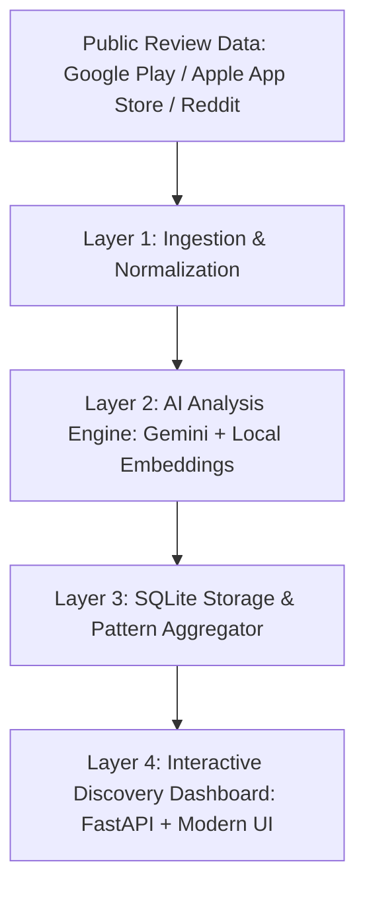

# 🛍️ Myntra Wishlist-to-Purchase AI Discovery Engine

> **An AI-powered discovery engine that uncovers why Myntra shoppers wishlist items but don't complete the purchase — discovered from real customer voice and behavioral language, with strictly ₹0 infrastructure cost and non-monetary solutions.**

---

## 🎯 The Core Problem & Philosophy

- **The Problem:** Across fashion eCommerce, millions of items are saved to wishlists daily, yet the conversion rate from wishlist to checkout remains low.
- **The Golden Rule:** *Whatever explains the drop-off between wishlisting and buying, the fix has to work through information, trust, confidence, or experience — **NOT price or monetary discounts**.*
- **Zero Assumption:** We do not guess customer hesitation upfront; it is derived and extracted from real public user reviews, Reddit discussions (`r/indianfashionadvice`, `r/india`), and Play Store feedback.

---

## 🏗️ 4-Layer Architecture (₹0 Free Tier Stack)



| Layer | Component | Technology | Cost |
|---|---|---|---|
| **Layer 1: Ingestion** | Scrapers & Cleaners | `google-play-scraper`, Apple App Store RSS JSON, `praw`, Apify Reddit, MinHash LSH Deduplication | ₹0 |
| **Layer 2: AI Analysis** | LLM & Classification | `gemini-3.5-flash-lite` (Free Tier) + `all-MiniLM-L6-v2` (Local CPU) | ₹0 |
| **Layer 3: Storage** | Database & Indexes | SQLite 3 (WAL Mode) with composite indexing | ₹0 |
| **Layer 4: Dashboard** | UI & REST API | FastAPI, Uvicorn, Chart.js, Vanilla CSS Glassmorphism | ₹0 |

---

## ⚡ Quick Start

### 1. Clone & Setup
```bash
git clone <repo-url>
cd Myntra-discovery-engine

# Create and activate virtual environment
python3 -m venv venv
source venv/bin/activate     # macOS / Linux
# venv\Scripts\activate      # Windows

pip install -r requirements.txt
```

### 2. Configure Environment
```bash
cp .env.example .env
```
Edit `.env` and add your **free** API keys:

| Key | Where to Get It | Required? |
|---|---|---|
| `GEMINI_API_KEY` | [Google AI Studio](https://aistudio.google.com) | ✅ Yes |
| `REDDIT_CLIENT_ID` / `SECRET` | [Reddit Apps](https://reddit.com/prefs/apps) | Optional (for PRAW) |
| `APIFY_API_TOKEN` | [Apify Console](https://console.apify.com/account/integrations) | Optional (free $5/mo) |

### 3. Run Ingestion Pipeline
```bash
# Scrape Google Play (100) and Apple App Store (100) reviews (~30 seconds)
python scripts/run_ingestion.py --gp-count 100 --app-store-count 100

# Scrape Apple App Store reviews only (RSS)
python scripts/run_ingestion.py --skip-gp --skip-reddit --app-store-count 100

# Scrape Apple App Store wishlisting reviews via Apify Actor (Deep Historical)
python scripts/run_ingestion.py --skip-gp --skip-reddit --skip-app-store --apify-app-store --apify-app-store-count 500

# Optional: also scrape Reddit via Apify (5 posts to save credits)
python scripts/run_ingestion.py --apify --apify-count 5
```

### 4. Run AI Analysis Pipeline
```bash
# Extract blockers, classify uncertainties, score confidence
python scripts/run_analysis.py --limit 50
```

### 5. Launch Dashboard
```bash
python scripts/run_dashboard.py --port 8000
```
Open **[http://127.0.0.1:8000](http://127.0.0.1:8000)** in your browser!

### 6. Seed with Demo Data (Optional)
```bash
# Populate the database with realistic mock data for demos
python scripts/seed_db.py
```

---

## 📊 Key Discovered Purchase Blockers

From real customer reviews analyzed by the engine:

1. **`delivery_uncertainty` (Confidence: 85%)**
   - *Customer Quote:* *"Ordered for an event in 6 days, app said delivery in 10 days without express option for my pincode. Cancelled and bought locally."*
   - *Non-Monetary Fix:* Live pincode delivery date preview on wishlist cards + guaranteed event delivery badges.

2. **`return_policy_concern` (Confidence: 80%)**
   - *Customer Quote:* *"Applied platform fee on each item which is non-refundable on returns. Hesitant to order 2 sizes to check fit."*
   - *Non-Monetary Fix:* Transparent size-exchange guarantees without fee loss + clear door-step size swap assurance.

3. **`quality_uncertainty` / `fit_anxiety`**
   - *Customer Quote:* *"Silk blend saree color looks emerald green in photo but teal in model video. Fabric transparency unclear."*
   - *Non-Monetary Fix:* Verified customer fabric close-up photos & body dimension fit distribution graphs.

---

## 🧪 Test Suite (59 Tests — All Passing)

Run the automated test suite covering all 4 layers:
```bash
pytest tests/ -v
```

| Test File | Coverage | Tests |
|---|---|---|
| `test_scrapers.py` | Google Play & Apify Reddit scrapers | 9 |
| `test_cleaner.py` | Text cleaning, PII removal, deduplication | 2 |
| `test_extractor.py` | LLM extraction (mocked), JSON parsing, retry logic | 11 |
| `test_classifier.py` | Taxonomy mapping, blocker/persona/uncertainty tags | 7 |
| `test_confidence.py` | Confidence scoring bounds, weighting, edge cases | 6 |
| `test_analysis.py` | Preprocessor, Classifier, ConfidenceScorer, Aggregator | 5 |
| `test_database.py` | SQLite CRUD operations | 1 |
| `test_api.py` | Dashboard HTML & all 5 REST API endpoints | 6 |
| `test_integration.py` | End-to-end pipeline & API integration | 11 |
| **Total** | | **59** |

---

## 🚀 Deployment

### Option A: Render.com (Recommended — Free, One-Click)

1. Push this repo to GitHub
2. Go to [render.com/new](https://dashboard.render.com)
3. Click **"New" → "Blueprint"** and connect your repo
4. Render auto-detects `render.yaml` and deploys — **no credit card needed**

### Option B: Docker

```bash
# Build the image
docker build -t myntra-discovery .

# Run with your environment variables
docker run -p 8000:8000 --env-file .env myntra-discovery

# Open http://localhost:8000
```

### Option C: Run Locally (Development)
```bash
python scripts/run_dashboard.py --port 8000 --reload
```

---

## 📂 Project Structure

```
Myntra-discovery-engine/
├── config/
│   ├── settings.py             # Typed environment settings & validation
│   └── taxonomy.yaml           # Canonical taxonomy (blockers, uncertainties, personas)
├── ingestion/
│   ├── scrapers/
│   │   ├── base_scraper.py     # Abstract scraper interface
│   │   ├── google_play_scraper.py  # Google Play Store reviews
│   │   ├── reddit_scraper.py   # Reddit via PRAW (free)
│   │   └── apify_scraper.py    # Reddit via Apify (free $5/mo tier)
│   ├── cleaners/
│   │   ├── text_cleaner.py     # HTML stripping, PII removal, emoji decoding
│   │   └── deduplicator.py     # MinHash LSH near-duplicate detection
│   ├── normalizer.py           # Unified schema & author hashing
│   └── orchestrator.py         # Ingestion pipeline coordinator
├── analysis/
│   ├── prompts/
│   │   └── extraction_prompt.txt  # Structured JSON extraction prompt
│   ├── preprocessor.py         # Relevance keyword filter & segmenter
│   ├── llm_extractor.py        # Gemini API client with smart rate pacing
│   ├── classifier.py           # Local sentence-transformers taxonomy mapper
│   ├── confidence_scorer.py    # 4-factor weighted scoring engine
│   └── aggregator.py           # Pattern rollup and cross-tabulation
├── storage/
│   └── database.py             # SQLite schema, indices, WAL mode, CRUD
├── dashboard/
│   ├── api.py                  # FastAPI backend — 5 REST endpoints
│   ├── templates/
│   │   └── index.html          # Semantic HTML5 glassmorphic dashboard
│   └── static/
│       ├── css/style.css       # Glassmorphic design system
│       └── js/app.js           # Interactive Chart.js visualizations
├── scripts/
│   ├── run_ingestion.py        # CLI: scrape & ingest reviews
│   ├── run_analysis.py         # CLI: AI extraction & analysis
│   ├── run_dashboard.py        # CLI: launch dashboard server
│   └── seed_db.py              # Realistic fashion dataset seeder
├── tests/                      # 59 automated unit & integration tests
├── Dockerfile                  # Multi-stage Docker build
├── render.yaml                 # Render.com one-click deployment config
├── requirements.txt            # Python dependencies (all free)
├── .env.example                # Environment variable template
└── .gitignore                  # Git ignore rules
```

---

## 💎 Cost Guarantee & Free Tier Limits

| Service | Free Tier Limit | Our Usage | Headroom |
|---|---|---|---|
| **Gemini 3.6 Flash** | 15 RPM, 1M tokens/day | ~5,000 reviews/day | Plenty |
| **Reddit API (PRAW)** | 100 req/min | ~10-20 req/session | Massive |
| **Apify** | $5.00/month free credit | ~$0.01 per 10 posts | ~500 scrapes/month |
| **Google Play Scraper** | No official limit | ~5,000 reviews/run | No issue |
| **Render Free Tier** | 750 hours/month | 1 instance = ~720 hrs | Under limit |
| **SQLite** | Unlimited (local file) | ~50K documents | Millions possible |
| **Hugging Face** | Unlimited (local model) | 80MB one-time download | N/A |

> **Total project cost: ₹0** — Every tool, API, hosting service, and library is completely free.

---

## 📜 License

MIT License — see [LICENSE](LICENSE) for details.
