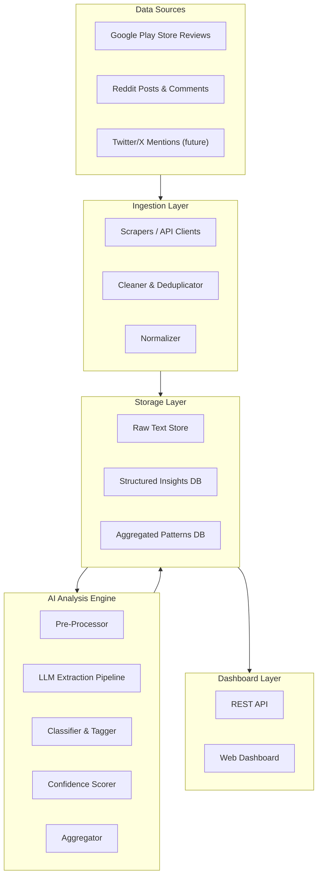
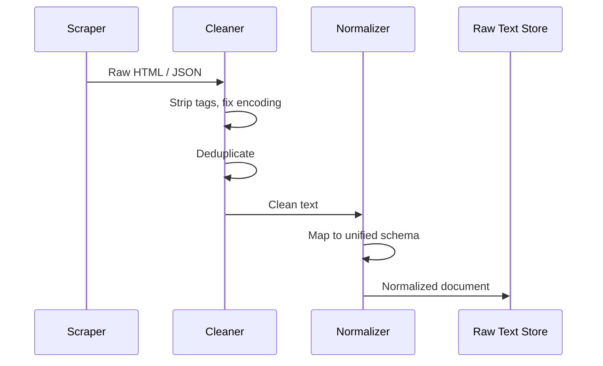
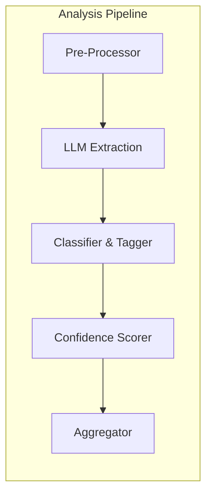
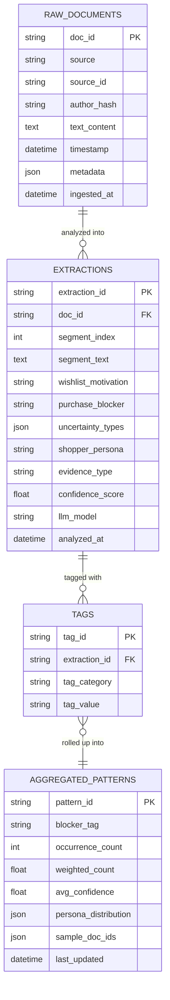
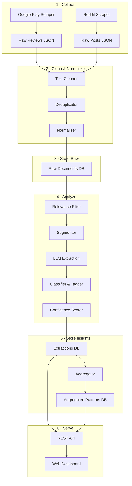
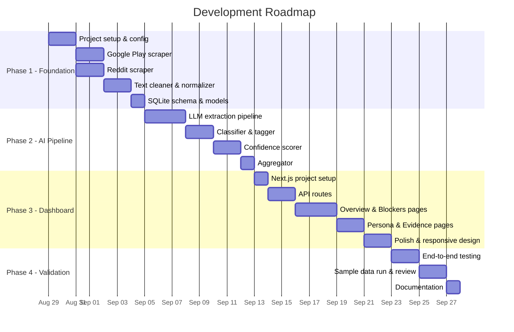

# Architecture — Myntra Wishlist-to-Purchase AI Discovery Engine

> Derived from [problemStatement.md](file:///Users/shubhamthakur/Downloads/nextleap%20antigravity%20projects/Myntra-discovery-engine/problemStatement.md)

---

## 1. System Overview

The Discovery Engine is a **four-layer pipeline** that turns raw, unstructured public user text (Google Play Store reviews, Reddit posts/comments) into structured, evidence-backed insights about why Myntra wishlisted items go unpurchased — all without assuming the answer upfront.


---

## 2. High-Level Architecture Diagram



---

## 3. Layer-by-Layer Breakdown

### 3.1 Data Sources

| Source | Type | Access Method | Cost | Volume Estimate |
|---|---|---|---|---|
| **Google Play Store** | App reviews for Myntra | `google-play-scraper` (Python, open-source) | **Free** | ~5,000–50,000 reviews |
| **Reddit** | Posts & comments from r/india, r/indianfashion, r/fashionadvice, Myntra-related threads | Reddit API (PRAW — free tier: 100 requests/min) | **Free** | ~1,000–10,000 relevant posts |
| **Twitter/X** *(future)* | Mentions of @myntra, wishlist-related tweets | Nitter scraper or public RSS feeds | **Free** | TBD |

> [!NOTE]
> All sources are **publicly available** data. No private user data, internal Myntra data, or PII is collected or stored.

---

### 3.2 Ingestion Layer

Responsible for collecting, cleaning, normalizing, and deduplicating raw text before it enters the analysis pipeline.

#### Components

```
ingestion/
├── scrapers/
│   ├── google_play_scraper.py      # Fetches Myntra app reviews
│   ├── reddit_scraper.py           # Fetches Reddit posts & comments
│   └── base_scraper.py             # Abstract base class
├── cleaners/
│   ├── text_cleaner.py             # HTML stripping, emoji handling, encoding fixes
│   └── deduplicator.py             # Near-duplicate detection (MinHash / SimHash)
├── normalizer.py                   # Standardizes schema across sources
└── orchestrator.py                 # Schedules and runs ingestion jobs
```

#### Data Flow



#### Unified Raw Document Schema

```json
{
  "doc_id": "uuid-v4",
  "source": "google_play | reddit | twitter",
  "source_id": "original platform ID",
  "author_hash": "anonymized SHA-256 hash",
  "text": "original user text (cleaned)",
  "timestamp": "ISO-8601 datetime",
  "metadata": {
    "rating": 4,
    "subreddit": "indianfashion",
    "upvotes": 23,
    "reply_to": "parent_doc_id or null"
  },
  "ingested_at": "ISO-8601 datetime"
}
```

---

### 3.3 AI Analysis Engine

The core of the system. Takes normalized text and extracts the five structured dimensions defined in the problem statement.

#### Pipeline Architecture



#### 3.3.1 Pre-Processor

- **Relevance Filter** — discard reviews that have nothing to do with wishlisting, purchase hesitation, or shopping behavior (e.g., delivery complaints, app crash reports)
- **Segmentation** — split long reviews into individual claim-level segments so each can be analyzed independently
- **Language Detection** — flag non-English text for separate handling or exclusion

#### 3.3.2 LLM Extraction Pipeline

Uses **Google Gemini 2.0 Flash** via the **free tier** of the Gemini API (15 requests/minute, 1 million tokens/day — no credit card required) with structured output prompting to extract the five key dimensions from each text segment.

> [!TIP]
> The Gemini free tier is more than sufficient for this project. At ~200 tokens per review, 1M tokens/day allows **~5,000 reviews/day** — enough to process the entire corpus in a few days with zero cost.

**Prompt Strategy: Structured JSON Extraction**

```
You are analyzing a real user's public review or comment about Myntra
(an Indian online fashion platform). Extract the following fields as JSON.
If a field cannot be determined from the text, set it to null.
Do NOT guess — only extract what the text explicitly or strongly implies.

Fields:
1. wishlist_motivation    — Why did the user save/wishlist this product?
2. purchase_blocker       — What is stopping them from buying?
3. uncertainty_type       — What kind of doubt do they express?
                            (fit, quality, price, occasion, trust, availability, other)
4. shopper_persona        — What type of shopper does this person seem to be?
                            (budget_conscious, occasion_shopper, inspiration_browser,
                             brand_loyal, trend_follower, gifter, other)
5. evidence_type          — Is this a direct_statement, inference, or weak_signal?

Input text: "{user_text}"
```

**Output Schema**

```json
{
  "doc_id": "references the raw document",
  "segment_index": 0,
  "segment_text": "the specific sentence/passage analyzed",
  "extraction": {
    "wishlist_motivation": "liked the design, planning for upcoming wedding",
    "purchase_blocker": "unsure if the color will match in person",
    "uncertainty_type": ["quality", "fit"],
    "shopper_persona": "occasion_shopper",
    "evidence_type": "direct_statement"
  },
  "llm_model": "gemini-2.0-flash",
  "llm_raw_response": "{ ... }",
  "analyzed_at": "ISO-8601 datetime"
}
```

#### 3.3.3 Classifier & Tagger

Post-processes LLM output to:

| Task | Method |
|---|---|
| **Normalize free-text fields** | Map `wishlist_motivation` and `purchase_blocker` to a controlled taxonomy using embedding similarity |
| **Multi-label tagging** | Assign one or more canonical tags from a predefined set |
| **Taxonomy management** | Allow new categories to emerge from data — semi-supervised clustering on LLM outputs to surface novel blockers |

**Canonical Taxonomy (starter — expected to grow)**

```yaml
purchase_blockers:
  - fit_uncertainty
  - size_uncertainty
  - quality_doubt
  - color_mismatch_fear
  - price_not_justified
  - occasion_mismatch
  - waiting_for_sale           # Note: we track this but won't solve with discounts
  - need_external_opinion
  - forgotten_wishlist
  - mood_board_usage
  - trust_in_reviews
  - stock_availability
  - delivery_uncertainty
  - return_policy_concern

uncertainty_types:
  - fit
  - quality
  - price
  - occasion
  - trust
  - availability
  - durability
  - styling

shopper_personas:
  - budget_conscious
  - occasion_shopper
  - inspiration_browser
  - brand_loyal
  - trend_follower
  - gifter
  - impulse_saver
```

#### 3.3.4 Confidence Scorer

Each extraction receives a **composite confidence score** (0.0–1.0) based on:

| Factor | Weight | Description |
|---|---|---|
| **Evidence type** | 0.40 | Direct statement > inference > weak signal |
| **Text specificity** | 0.25 | "Size chart was wrong for me" > "might not fit" |
| **LLM self-consistency** | 0.20 | Run the same text twice with temperature > 0; agreement boosts confidence (single free model, two passes) |
| **Source reliability** | 0.15 | Detailed review > one-line rating > social media quip |

> [!IMPORTANT]
> Every insight surfaced in the dashboard must carry its confidence score so reviewers never mistake a weak signal for a proven fact.

#### 3.3.5 Aggregator

Rolls individual extractions up into **pattern-level summaries**:

- Count occurrences of each `purchase_blocker` tag
- Compute distribution of `uncertainty_type` across the corpus
- Cross-tabulate `shopper_persona × purchase_blocker` to find persona-specific blockers
- Track trends over time (if timestamps allow)
- Weight counts by confidence score (a `direct_statement` with 0.9 confidence counts more than a `weak_signal` at 0.3)

---

### 3.4 Storage Layer



#### Technology Choice

| Concern | Choice | Cost | Rationale |
|---|---|---|---|
| **Raw text** | SQLite | **Free** (built into Python) | Zero-install, file-based, perfect for MVP |
| **Embeddings cache** | ChromaDB | **Free** (open-source, local) | Fast vector similarity for taxonomy mapping |
| **Aggregated patterns** | Same SQLite DB | **Free** | Pre-computed tables alongside raw data |
| **File artifacts** | Local filesystem | **Free** | Raw scraper outputs, LLM response logs — no cloud storage needed |

> [!TIP]
> SQLite ships with Python — literally zero setup, zero cost. The entire database is a single `.db` file you can copy, share, or back up.

---

### 3.5 Dashboard Layer

A **web-based, shareable dashboard** that lets product team reviewers explore findings without touching code or spreadsheets.

#### Dashboard Pages

| Page | Purpose |
|---|---|
| **Overview** | High-level stats: total documents, extraction count, top 5 purchase blockers (bar chart), confidence distribution |
| **Purchase Blockers** | Ranked list of blockers with occurrence count, avg confidence, sample quotes, and persona breakdown |
| **Uncertainty Explorer** | Filter by uncertainty type; see the actual user text behind each tag |
| **Persona View** | Per-persona breakdown of what stops each shopper type from buying |
| **Evidence Drilldown** | Click any pattern to see the raw text, extraction JSON, and confidence breakdown |
| **Data Quality** | Tracks low-confidence extractions, untagged documents, and taxonomy gaps |

#### Tech Stack

| Component | Technology | Cost |
|---|---|---|
| **Frontend** | Next.js (React) with vanilla CSS | **Free** (open-source) |
| **Charts** | Recharts or Chart.js | **Free** (open-source) |
| **API** | Next.js API routes (REST) | **Free** (open-source) |
| **Hosting** | Vercel free tier (hobby plan, no CC needed) or local `npm run dev` | **Free** |

#### Key API Endpoints

```
GET  /api/overview              → summary stats + top blockers
GET  /api/blockers              → paginated list of purchase blockers
GET  /api/blockers/:tag         → detail for a specific blocker tag
GET  /api/uncertainties         → uncertainty type distribution
GET  /api/personas              → persona distribution + cross-tab
GET  /api/extractions           → paginated extractions with filters
GET  /api/extractions/:id       → single extraction with full detail
GET  /api/documents/:id         → raw document + all its extractions
GET  /api/quality               → data quality metrics
```

---

## 4. End-to-End Data Flow



---

## 5. Technology Stack Summary (100% Free)

> [!IMPORTANT]
> **Every single tool in this stack is free.** No paid APIs, no subscriptions, no credit card required anywhere.

| Layer | Technology | Cost | Notes |
|---|---|---|---|
| **Language** | Python 3.11+ | Free | Scrapers, analysis pipeline, API glue |
| **Scraping** | `google-play-scraper`, `praw` | Free | Open-source libraries; public data only |
| **LLM** | Google Gemini 2.0 Flash (free tier) | **₹0** | 15 RPM, 1M tokens/day, no credit card |
| **Embeddings** | `all-MiniLM-L6-v2` (Hugging Face) | **₹0** | Runs 100% locally, no API calls |
| **Vector Store** | ChromaDB | Free | Open-source, local-first |
| **Database** | SQLite | Free | Ships with Python, zero setup |
| **Backend API** | Next.js API Routes | Free | Open-source |
| **Frontend** | Next.js + React + Vanilla CSS | Free | Open-source |
| **Charts** | Recharts | Free | Open-source, React-native charting |
| **Deployment** | Vercel free tier / local `npm run dev` | **₹0** | No paid hosting needed |

**Total project cost: ₹0**

---

## 6. Project Directory Structure

```
Myntra-discovery-engine/
├── problemStatement.md
├── architecture.md                  ← this file
├── README.md
│
├── ingestion/                       # Layer 1: Data collection
│   ├── scrapers/
│   │   ├── base_scraper.py
│   │   ├── google_play_scraper.py
│   │   └── reddit_scraper.py
│   ├── cleaners/
│   │   ├── text_cleaner.py
│   │   └── deduplicator.py
│   ├── normalizer.py
│   └── orchestrator.py
│
├── analysis/                        # Layer 2: AI analysis
│   ├── preprocessor.py              # Relevance filter + segmenter
│   ├── llm_extractor.py             # LLM prompt + structured output
│   ├── classifier.py                # Taxonomy mapping + tagging
│   ├── confidence_scorer.py         # Composite scoring
│   ├── aggregator.py                # Pattern roll-up
│   └── prompts/
│       └── extraction_prompt.txt
│
├── storage/                         # Layer 3: Data persistence
│   ├── database.py                  # DB connection + ORM models
│   ├── migrations/
│   └── seeds/
│
├── dashboard/                       # Layer 4: Web dashboard
│   ├── app/
│   │   ├── layout.js
│   │   ├── page.js                  # Overview page
│   │   ├── blockers/
│   │   │   └── page.js
│   │   ├── uncertainties/
│   │   │   └── page.js
│   │   ├── personas/
│   │   │   └── page.js
│   │   └── api/
│   │       ├── overview/route.js
│   │       ├── blockers/route.js
│   │       ├── extractions/route.js
│   │       └── personas/route.js
│   ├── components/
│   │   ├── ConfidenceBadge.jsx
│   │   ├── BlockerCard.jsx
│   │   ├── PersonaChart.jsx
│   │   └── EvidenceDrawer.jsx
│   ├── styles/
│   │   └── globals.css
│   ├── package.json
│   └── next.config.js
│
├── data/                            # Local data directory
│   ├── raw/                         # Raw scraper outputs
│   ├── processed/                   # Cleaned + normalized
│   └── myntra_discovery.db          # SQLite database
│
├── config/
│   ├── settings.py                  # Gemini free API key, model config
│   └── taxonomy.yaml                # Canonical tag definitions
│
├── scripts/
│   ├── run_ingestion.py             # CLI: run full ingestion
│   ├── run_analysis.py              # CLI: run analysis pipeline
│   └── seed_db.py                   # Seed DB with sample data
│
├── tests/
│   ├── test_scrapers.py
│   ├── test_cleaner.py
│   ├── test_extractor.py
│   └── test_api.py
│
├── requirements.txt
├── .env.example
└── .gitignore
```

---

## 7. Key Design Decisions

### 7.1 Why LLM-Based Extraction Over Classical NLP?

| Approach | Pros | Cons |
|---|---|---|
| **Rule-based / Regex** | Fast, deterministic, free | Brittle, misses nuance, requires manual rule creation |
| **Classical ML (BERT fine-tune)** | Good accuracy with labeled data | Requires a labeled training set we don't have yet |
| **LLM with structured prompting** ✅ | Handles nuance, works zero-shot, outputs structured JSON, **Gemini free tier = ₹0** | Rate-limited (15 RPM), needs confidence calibration |

We choose LLMs because the problem explicitly requires us to **discover** patterns, not classify into pre-known categories. LLMs excel at open-ended extraction from noisy, colloquial text. The Gemini free tier makes this viable at **zero cost**.

### 7.2 Confidence Scoring — Why It Matters

The problem statement warns against overstating findings. The confidence scoring system ensures:

- **Direct quotes** ("I didn't buy because the size chart was wrong") get high confidence
- **Inferences** ("seems like quality might be an issue") get medium confidence
- **Weak signals** (a vague negative comment) get low confidence
- The dashboard **always** shows the confidence level alongside any claim

### 7.3 Taxonomy as a Living Document

The canonical taxonomy starts with educated categories but is designed to **grow from the data**:

1. LLM extractions produce free-text fields
2. Embedding similarity maps them to existing taxonomy tags
3. When a cluster of extractions doesn't map well to any existing tag → flag as **"emerging pattern"**
4. A human reviewer confirms whether it becomes a new canonical tag

---

## 8. Non-Functional Requirements

| Requirement | Target |
|---|---|
| **Data freshness** | Ingestion can run on-demand or scheduled (daily/weekly) |
| **Analysis latency** | ≤ 5 seconds per document through the LLM pipeline (subject to free tier rate limits) |
| **Throughput** | ~5,000 reviews/day within Gemini free tier limits (1M tokens/day, 15 RPM) |
| **Dashboard response** | ≤ 500ms for API responses (pre-aggregated data) |
| **Scalability** | MVP handles 50K documents; architecture supports horizontal scaling |
| **Privacy** | No PII stored; author identities are SHA-256 hashed |
| **Cost** | **₹0 — completely free.** All tools are open-source or free-tier. No credit card required anywhere. |
| **Reproducibility** | Every extraction links back to raw text + LLM model version + prompt version |

---

## 9. Security & Privacy

> [!CAUTION]
> Even though all data is public, the following safeguards are mandatory.

- **No PII Storage** — Author usernames are hashed before storage; no profile linking
- **API Keys** — Stored in `.env`, never committed to version control
- **Rate Limiting** — Scrapers respect platform rate limits and `robots.txt`
- **Data Retention** — Raw text is kept for auditability; can be purged on schedule
- **Access Control** — Dashboard is read-only; no write endpoints exposed publicly

---

## 10. Development Phases



---

## 11. Risks & Mitigations

| Risk | Impact | Mitigation |
|---|---|---|
| **LLM hallucination** | False patterns in output | Confidence scoring + evidence linking + human review |
| **Insufficient wishlist-specific data** | Too few relevant reviews | Broaden search terms; include adjacent fashion platforms |
| **API rate limits (scraping)** | Scraping blocked | Respect rate limits; cache aggressively; use exponential backoff |
| **Gemini free tier rate limits** | Slow processing (15 RPM cap) | Batch with delays; cache LLM responses to avoid re-processing; process overnight |
| **Taxonomy drift** | Categories become inconsistent | Periodic taxonomy review; embedding-based normalization |
| **Gemini free tier discontinued** | No LLM access | Fall back to local Ollama + Llama 3 (free, runs on any machine with 8GB RAM) |
| **Bias in public reviews** | Skewed toward extreme opinions | Acknowledge as limitation; weight by confidence; note in dashboard |
