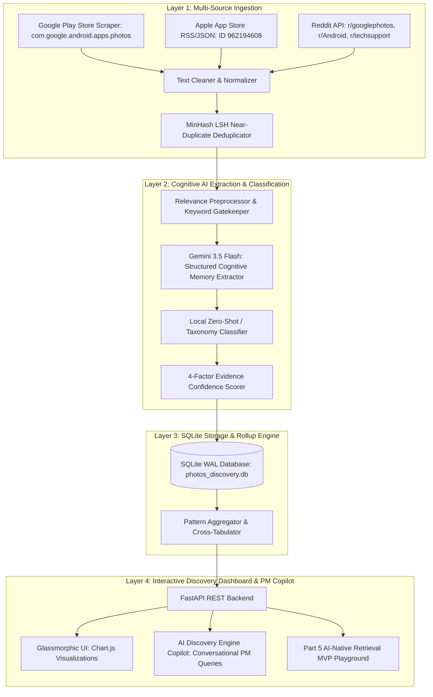

# 🏛️ Google Photos Retrieval Discovery Engine — System Architecture

> **An AI-powered discovery engine analyzing real user struggles with photo retrieval when memory is incomplete, with strictly ₹0 infrastructure cost.**

---

## 1. High-Level 4-Layer Architecture

---

## 2. Layer-by-Layer Technical Specification

### Layer 1: Multi-Source Ingestion
* **Scrapers:**
  * `google-play-scraper`: Fetches recent and critical reviews for `com.google.android.apps.photos` filtered for search, retrieve, memory, and find issues.
  * Apple App Store customer reviews via App Store RSS & API for iOS App ID `962194608`.
  * Reddit Scraper via `praw` and Apify across `r/googlephotos`, `r/google`, `r/Android`, `r/techsupport` with query terms `search photo`, `find picture`, `can't find`, `remember`, `lost photo`, `search impossible`.
* **Cleaning & Normalization:**
  * Strips emojis, URLs, and HTML entities while preserving episodic storytelling punctuation.
  * Generates consistent author hash `SHA256(author_id + platform)`.
  * MinHash LSH deduplication prevents duplicate reposts.

### Layer 2: Cognitive AI Analysis Engine
* **Cognitive Memory Extraction Schema:**
  * **Photo Category:** `Episodic Memory / Event`, `Visual Utility / Receipt / Doc`, `Aesthetic / Inspiration / Vibe`, `Personal / People / Milestone`, `Screenshot / Saved Media`.
  * **Remembered Clues:** `Visual Anchor`, `Social Context / People`, `Emotional / Vibe`, `Spatial Context / Scenery`, `Temporal Approximation`.
  * **Forgotten Elements:** `Exact Date / Timestamp`, `Specific Location / GPS`, `Album Name`, `Literal OCR Keywords`.
  * **Search Formulation Behavior:** `Keyword Stacking`, `Descriptive Sentence`, `Synonym Bashing`, `Immediate Scroll Abandonment`.
  * **Retrieval Failure Point:** `Zero Results / False Negative`, `Irrelevant Overload (500+ photos)`, `Semantic Misunderstanding`, `Clutter / Duplicate Noise`, `UI Refinement Collapse`.
* **LLM Engine:** Google Gemini Flash (`gemini-3.5-flash`) structured JSON extraction with automated fallback and rate-limit throttling (15 RPM / 1M tokens free tier).
* **Confidence Scoring:** 4-factor scoring model measuring text specificity, emotional intensity, query presence, and memory granularity.

### Layer 3: SQLite Storage & Analytics
* **Storage Engine:** SQLite 3 in WAL (Write-Ahead Logging) mode with compound indices for sub-millisecond aggregation:
  * `raw_documents`: Source reviews, timestamps, author hashes, platform metadata.
  * `extractions`: Parsed cognitive attributes, remembered clues, forgotten elements, failure points, confidence scores.
  * `tag_mappings`: Normalized taxonomy associations.
  * `aggregate_metrics`: Pre-computed distributions for lightning-fast dashboard rendering.

### Layer 4: Interactive Discovery Dashboard & PM Copilot
* **Frontend:** Vanilla HTML5 + Glassmorphic Dark UI + Chart.js. Zero frontend framework overhead (<100KB payload).
* **API Endpoints:**
  * `GET /`: Serves the Interactive Discovery Dashboard.
  * `GET /api/overview`: High-level counts, top failure points, confidence scores, and source distribution.
  * `GET /api/retrieval-failures`: Breakdown of where photo retrieval fails.
  * `GET /api/memory-clues`: Comparative radar/doughnut data on What Users Remember vs. What They Forget.
  * `GET /api/query-patterns`: Analysis of how users formulate partial-memory searches.
  * `POST /api/ask`: AI Discovery Copilot answering qualitative PM research questions backed by grounded review evidence.
  * `GET /api/llm-status`: Health and connectivity check for the Gemini LLM.
  * `POST /api/retrieval-mvp/search`: Interactive Part 5 MVP prototype endpoint demonstrating associative memory retrieval.

---

## 3. Free Tier ₹0 Infrastructure Guarantee

| Service | Free Tier Allocation | Our Consumption | Cost |
|---|---|---|---|
| **Google Gemini 3.5 Flash** | 15 RPM, 1M tokens/day | ~5,000 extractions/day | ₹0 |
| **SQLite 3** | Local zero-config | Serverless embedded | ₹0 |
| **Render Web Service** | 750 free instance hours/month | 1 instance continuous | ₹0 |
| **Reddit API (PRAW)** | 100 requests/minute | 10-20 requests/run | ₹0 |
| **Total Monthly Cost** | — | — | **₹0.00** |
